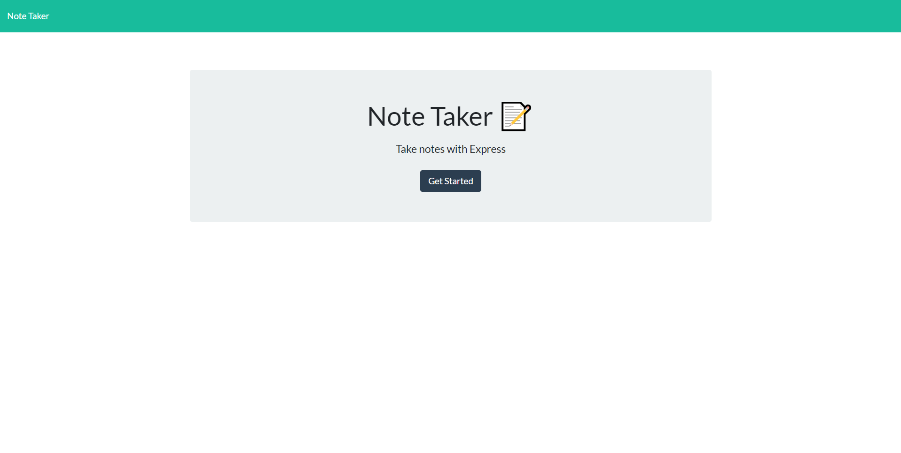
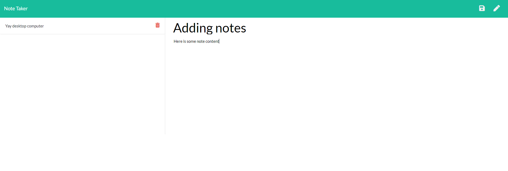
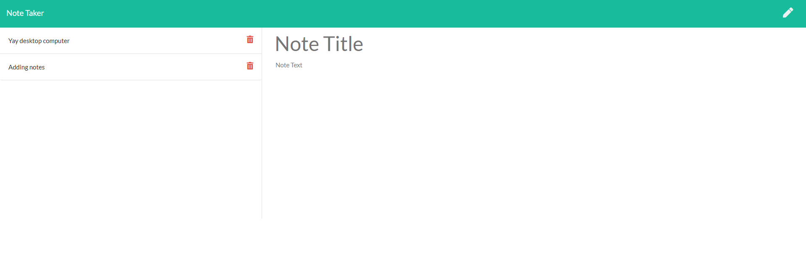

# Note-Taker
Full stack application that allows the user the create and save notes, view saved notes, as well as delete saved notes.

# Screenshots
Home Page

Adding Notes

Saved Notes

# Built With
* HTML
* CSS
* Javascript
* jQuery
* Node.js
* Express.js

# Functionality
The user can click the pen on the right side of the page to create a new note, which has a title and content. Once content has been added to the note, the user may save the note. All saved notes are displayed on the left side of the page, and if clicked on will pull up the note in the main section of the page for viewing. If the red trash can next to the saved notes is clicked, that note will be deleted and removed from the list.

# Authors
Cassidy Fortner